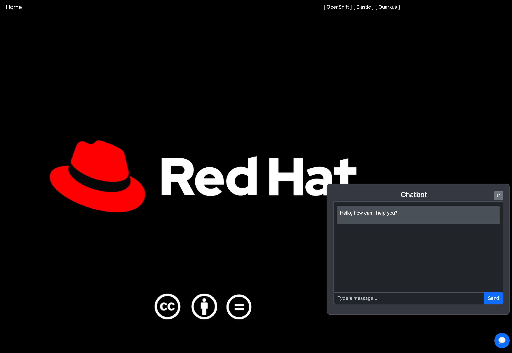
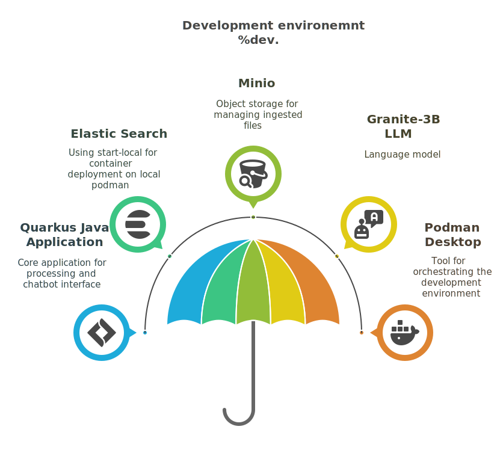
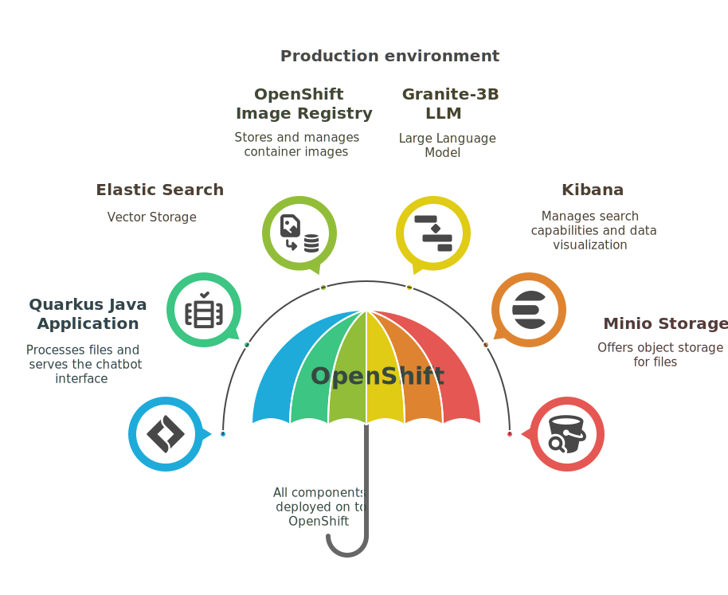
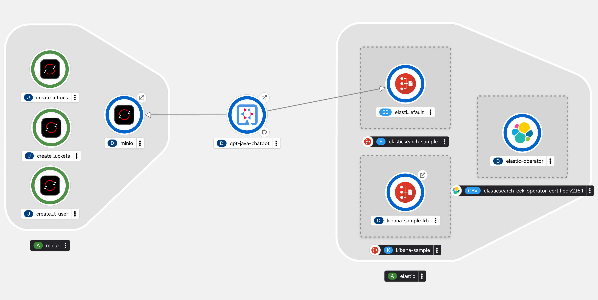

> - This is a human generated `README` with likely errors. 
> - This `README` file was not generated by an LLM. 
> - Although images in this README were generated using <napkin.ai> 

# A Java/Quarkus Chatbot using Elastic Search


This is a chat bot application demonstrating the use of Elastic Vector search capabilities together with Quarkus a blazing fast Java framework.

The Quarkus application ingests documents from storage, for which we use minio. It then stores the embeddings to Elastic search. Everytime a user makes a request asking a question, a similarity search is done on the Elastic Vector store. This way additional context is provided to the LLM. 

The project can be used in developement environment i.e. is the local developer machine or in production environment which in this case is the OpenShift platform.


## Development Environment Components



### Quarkus Java Application
Serves as the core application that processes ingested files and creates embeddings using the AllMiniLmL6V2EmbeddingModel from LangChain4J. Hosts the chatbot interface for user interaction.

### Elastic Search
Utilized for vector storage, allowing efficient searching and retrieval of embeddings.
Operated via `start-local` for local development.


### Minio
Acts as the object storage solution for storing the actual files ingested by the Quarkus application. Runs in a containerized environment for easy management. The docker file also has an intializer service that creates a bucket and loads the documents into it from the `.documents` dir. 


### LLM
A language model used for generating embeddings and enhancing the chatbot's capabilities. We use the Granite model. However if you wish its also possible to use OpenAI. see the `application.properties` file for more details. Comment the model URL and uncomment the OPENAI_API_KEY in that case. 

### Podman Desktop
The container management tool used to orchestrate the development environment, facilitating the deployment of the above components. We can use the Podman desktop AI extension to host the granite model. 


### How to run the dev environment
There are two ways to do this. The default docker compose-file resides in `deploy/`. however its experimental and does not have all the features enabled. especially Kibana. The second option is to use the official elastic cli which has all essentials loaded 

```bash
curl -fsSL https://elastic.co/start-local | sh
cd elastic-start-local
sh start.sh
```
 
After that run the docker-compose file to get the minio service started as well.

```bash
docker-compose -f deploy/docker-compose.yml up
```

This will bring up the local minio environment as well. 

once the services are started. head over to another terminal and run
```shell script
./mvnw compile quarkus:dev
```

now browse to `http://localhost:8080` and that should bring up the Chatbot. 

There are a bunch of personalities with skills etc in the `document/` directory. you can ask questions like. 
```
Who is AI Alex? 
or 
What happend when Spring boot Sally and ThreadLocal Theo went to dinner?
``` 

## Production Environment Components




### Quarkus Java Application
Similar to the development environment, it processes files and serves the chatbot interface.


### OpenShift
The platform for deploying the Quarkus application in a production setting, providing scalability and management features.

### OpenShift Image Registry
Used for storing and managing container images of the Quarkus application and other components. We use the Quarkus OpenShift extension to deploy to OpenShift.


### LLM
Continues to provide embedding generation and support for the chatbot in the production environment. We can use Granite-3B or OpenAI


### Elastic Search and Kibana
Deployed via operators for efficient management and monitoring of the search capabilities and data visualization.

### Minio Storage
Maintains the same role as in development, providing object storage for files in a production-ready manner.

The final deployed application should look something like below.

### To deploy
Ensure the Elastic Operator is installed in OpenShift. the CR yaml files are in `deploy/openshift`

Once Elastic and Kibana are installed. We need configure the certificate as well.

To deploy minio use the following yaml [file](https://github.com/sshaaf/basic-kserve-vllm/blob/main/setup/setup-s3.yaml)  


Once minio is deployed the secret should be available in OpenShift secrets. you will need to create the following secret before deploying the quarkus application. 

Under deploy/OpenShift there are additonal application deployment files that need to be executed in the following order
- app-configmap.yaml
- app-secret.yaml
- deployment.yaml


The application can also be deployed using the Quarkus OpenShift extension as follows

```bash
mvn clean compile package -Dquarkus.kubernetes.deploy=true -DskipTests
```

